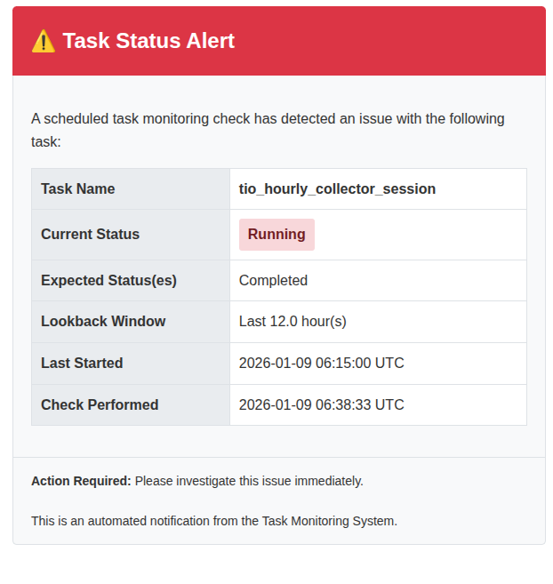
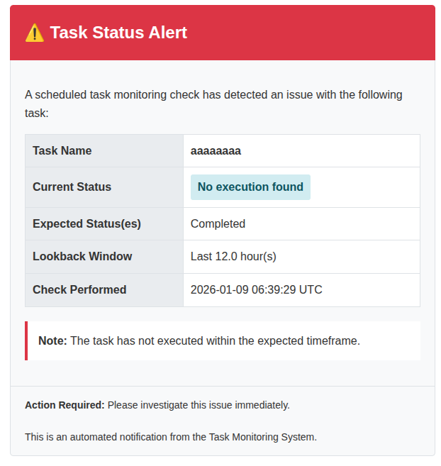

# Task Status Monitoring System

## Overview

The Task Status Monitoring System provides automated monitoring of background Celery tasks and sends email notifications when tasks don't reach expected statuses within specified time windows. This helps administrators proactively detect and respond to task failures or delays.

## Key Features

- **Automated Status Checking** - Monitor multiple tasks with customizable status expectations
- **Lookback Window** - Configurable time window for checking task execution
- **Email Notifications** - HTML email alerts with detailed task information
- **Dependent Task Warnings** - Track and warn about downstream task impacts
- **Flexible Recipients** - Custom email lists or automatic superuser fallback
- **Context Validation** - Advanced filtering by task context type (e.g., specific ingestor types)

---

## Configuration Format

The monitoring task accepts a configuration dictionary that maps task names to their monitoring settings:

```python
{
    "task_name": {
        "expected_statuses": ["Completed"],           # Required
        "notify_to": ["admin@example.com"],           # Optional
        "dependent_tasks": ["Task Y", "Task Z"],      # Optional
        "lookback_hours": 1,                          # Optional, default: 1
        "context_model": "gap.models.IngestorSession", # Optional (advanced)
        "context_type": "Hourly Tomorrow.io"          # Optional (advanced)
    }
}
```

### Configuration Parameters

| Parameter | Type | Required | Default | Description |
|-----------|------|----------|---------|-------------|
| `expected_statuses` | List[str] | **Yes** | - | List of acceptable task statuses (e.g., `["Completed"]`, `["Completed", "Running"]`) |
| `notify_to` | List[str] | No | Superusers | Email addresses to notify. If empty or not specified, notifications are sent to all superusers |
| `dependent_tasks` | List[str] | No | `[]` | List of task names that depend on this task. Warnings are included in notification emails |
| `lookback_hours` | int/float | No | `1` | Time window (in hours) to check for task execution. Can be integer or decimal (e.g., `1.5`) |
| `context_model` | str | No | - | Model path for context validation (e.g., `"gap.models.IngestorSession"`) |
| `context_type` | str | No | - | Expected context type for filtering (e.g., `"Hourly Tomorrow.io"`) |

### Available Task Statuses

The following status values can be used in `expected_statuses`:

- `Pending` - Task submitted but not queued
- `Queued` - Task queued for execution
- `Running` - Task currently executing
- `Completed` - Task finished successfully
- `Stopped` - Task stopped with error
- `Cancelled` - Task was cancelled
- `Invalidated` - Task was invalidated for retry

**Common configurations:**
- `["Completed"]` - Only accept successful completion
- `["Completed", "Running"]` - Accept if completed or still running
- `["Completed", "Stopped"]` - Accept both success and failure (for monitoring only)

---

## Lookback Hours Explanation

The `lookback_hours` parameter defines the time window for checking task execution history. It determines how far back the system should look when searching for the most recent task execution.

### How It Works

When a monitoring check runs:
1. Calculate the lookback threshold: `current_time - lookback_hours`
2. Query for the most recent task with `started_at >= lookback_threshold`
3. Check if the status matches expected values
4. Send notification if no task found or status doesn't match

### Choosing Appropriate Lookback Windows

**Guidelines:**

| Task Frequency | Recommended Lookback | Example |
|---------------|---------------------|---------|
| Every hour | 1-2 hours | Hourly data collection tasks |
| Every 2 hours | 2-3 hours | Bi-hourly processing tasks |
| Daily | 24-25 hours | Daily report generation |
| Weekly | 168-170 hours (7+ days) | Weekly aggregation tasks |

**Best Practices:**

1. **Make it slightly longer than task interval**
   - For a task expected every hour, use `lookback_hours: 1.5` or `2`
   - This accommodates normal variations in task duration

2. **Account for delays**
   - If tasks occasionally take longer, increase the window
   - Example: A task usually completes in 30 min but sometimes takes 2 hours → use `lookback_hours: 3`

3. **Consider monitoring frequency**
   - If you check every hour, lookback of 1 hour is usually sufficient
   - If you check less frequently, increase the lookback window proportionally

4. **Use decimal values for precision**
   - `lookback_hours: 1.5` checks last 1.5 hours (90 minutes)
   - Useful for fine-tuning monitoring windows

**Examples:**

```python
# Hourly task checked 5 minutes after expected completion
{
    "hourly_data_sync": {
        "expected_statuses": ["Completed"],
        "lookback_hours": 1  # Check last hour
    }
}

# Daily task with variable duration
{
    "daily_report": {
        "expected_statuses": ["Completed"],
        "lookback_hours": 25  # Check last 25 hours (daily + buffer)
    }
}

# Bi-hourly task with tolerance
{
    "data_processing": {
        "expected_statuses": ["Completed", "Running"],
        "lookback_hours": 2.5  # Check last 2.5 hours
    }
}
```

---

## Creating Periodic Tasks via Django Admin

### Step 1: Access Django Admin

Navigate to: **Django Admin → Periodic Tasks → Add Periodic Task**

### Step 2: Configure Basic Settings

**Name:** Give your monitoring task a descriptive name
Example: `Monitor Critical Data Collection Tasks`

**Task (registered):** Type or select `monitor_task_status`
Note: You may need to type this manually if it doesn't appear in the dropdown

**Enabled:** ✓ Check this box to activate monitoring

### Step 3: Configure Arguments

The `Arguments` field accepts JSON array with one dictionary containing your monitoring configuration:

```json
[
  {
    "task_name_1": {
      "expected_statuses": ["Completed"],
      "notify_to": ["admin@example.com"],
      "dependent_tasks": ["task_name_2"],
      "lookback_hours": 1
    },
    "task_name_2": {
      "expected_statuses": ["Completed"],
      "lookback_hours": 2
    }
  }
]
```

**Important:** The JSON must be an array containing a single dictionary (note the outer `[` and `]`).

### Step 4: Configure Schedule

**Option A: Crontab Schedule**

Click "Create new Crontab Schedule" or select existing:

| Example | Crontab | Description |
|---------|---------|-------------|
| Every hour at :05 | `5 * * * *` | Runs at 00:05, 01:05, 02:05, etc. |
| Every 2 hours at :05 | `5 */2 * * *` | Runs at 00:05, 02:05, 04:05, etc. |
| Daily at 10:05 AM UTC | `5 10 * * *` | Runs once daily at 10:05 AM |
| Every 30 minutes | `*/30 * * * *` | Runs at :00 and :30 every hour |
| Monday at 9:00 AM | `0 9 * * 1` | Runs weekly on Monday |

**Option B: Interval Schedule**

For simpler intervals like "every X minutes/hours":
- Every 30 minutes: Period=30, Unit=Minutes
- Every 2 hours: Period=2, Unit=Hours

### Step 5: Save

Click **Save** to activate the monitoring task.

---

## Example JSON Configurations

### Example 1: Simple Hourly Task Monitoring

Monitor a single hourly task, check 5 minutes after expected completion:

```json
[
  {
    "hourly_data_sync": {
      "expected_statuses": ["Completed"],
      "notify_to": ["data-team@example.com"],
      "lookback_hours": 1
    }
  }
]
```

**Crontab:** `5 * * * *` (every hour at :05)

### Example 2: Multiple Tasks with Dependencies

Monitor a data pipeline with dependent tasks:

```json
[
  {
    "data_collection": {
      "expected_statuses": ["Completed"],
      "notify_to": ["ops@example.com"],
      "dependent_tasks": ["data_processing", "data_export"],
      "lookback_hours": 1
    },
    "data_processing": {
      "expected_statuses": ["Completed", "Running"],
      "dependent_tasks": ["data_export"],
      "lookback_hours": 2
    },
    "data_export": {
      "expected_statuses": ["Completed"],
      "lookback_hours": 3
    }
  }
]
```

**Crontab:** `*/30 * * * *` (every 30 minutes)

### Example 3: Daily Tasks with Fallback to Superusers

Monitor daily tasks without specifying recipients (uses superusers):

```json
[
  {
    "daily_report_generation": {
      "expected_statuses": ["Completed"],
      "lookback_hours": 25
    },
    "daily_cleanup": {
      "expected_statuses": ["Completed"],
      "lookback_hours": 24
    }
  }
]
```

**Crontab:** `5 9 * * *` (daily at 9:05 AM UTC)

### Example 4: IngestorSession with Context Validation (Advanced)

Monitor specific ingestor type execution:

```json
[
  {
    "ingestor_session": {
      "context_model": "gap.models.IngestorSession",
      "context_type": "Hourly Tomorrow.io",
      "expected_statuses": ["Completed"],
      "notify_to": ["weather-team@example.com"],
      "dependent_tasks": ["forecast_processing"],
      "lookback_hours": 2
    }
  }
]
```

**Crontab:** `5 */2 * * *` (every 2 hours at :05)

---

## Notification Recipient Logic

The system determines email recipients using the following logic:

### Priority Order

1. **Custom Recipients** - If `notify_to` is specified and not empty
   - Emails are sent to the specified addresses
   - Superusers are NOT included automatically

2. **Superuser Fallback** - If `notify_to` is not specified or empty
   - System fetches all superuser emails from Django User model
   - Only superusers with valid, non-empty email addresses are included

3. **No Recipients Error** - If both conditions fail
   - A `ValueError` exception is raised
   - The full email content is logged to error logs
   - Task monitoring fails with clear error message

### Recipient Resolution Examples

**Example 1: Custom Recipients**
```python
"notify_to": ["admin@example.com", "devops@example.com"]
```
→ Emails sent to: `admin@example.com`, `devops@example.com`

**Example 2: Empty notify_to (Superuser Fallback)**
```python
"notify_to": []  # or not specified
```
→ Emails sent to: All superusers with email addresses

**Example 3: No Recipients Available**
```python
"notify_to": []  # Empty
# AND no superusers exist
```
→ **Error:** `ValueError: notify_to is empty but no superuser found for task 'task_name'`

### Setting Up Superusers

If you want to use the superuser fallback:

```bash
python manage.py createsuperuser
```

Ensure the superuser has a valid email address during creation.

### Best Practices

1. **Use explicit `notify_to` for critical tasks**
   - Ensures specific people are notified
   - Not dependent on superuser configuration

2. **Use superuser fallback for general monitoring**
   - Automatic recipient management
   - New superusers automatically receive notifications

3. **Always have at least one notification method**
   - Either specify `notify_to` OR ensure superusers exist
   - System will raise error if neither is available

---

## Email Notifications

### Email Content

Notification emails include:

- **Task name** - Identifies which task has an issue
- **Current status** - Actual status found (or "No execution found")
- **Expected status(es)** - What statuses were acceptable
- **Lookback window** - Time window checked (e.g., "Last 1 hour(s)")
- **Execution times** - When task last started/finished (if available)
- **Check timestamp** - When the monitoring check was performed
- **Dependent tasks warning** - Tasks that may be affected (if specified)

### Email Scenarios

#### Scenario 1: Status Doesn't Match Expected

When a task is found but has wrong status:



**Subject:** `[ALERT] {task_name} Status Check Failed`

**Key Information:**
- Shows actual status vs expected status
- Includes execution timestamps
- Provides lookback window context

#### Scenario 2: Task Hasn't Executed

When no task execution found within lookback window:



**Subject:** `[ALERT] {task_name} Has Not Executed`

**Key Information:**
- Clear "No execution found" status
- Shows the time window checked
- Note about task not executing within expected timeframe

#### Scenario 3: Dependent Tasks Warning

When a task with dependencies fails:


**Subject:** `[ALERT] {task_name} Status Check Failed`

**Key Information:**
- All standard task information
- **Warning box** highlighting dependent tasks
- List of tasks that may be delayed or fail

### Email Subjects

The system uses different subject lines based on the scenario:

- **Status mismatch:** `[ALERT] {task_name} Status Check Failed`
- **No execution:** `[ALERT] {task_name} Has Not Executed`

---

## Email Template Customization

The HTML email template is located at:

```
django_project/frontend/templates/emails/task_status_alert.html
```

### Customizing the Template

1. **Edit the template file** at the path above
2. **Maintain the context variables** used in the template
3. **Test thoroughly** with your email client

### Available Template Variables

| Variable | Type | Description |
|----------|------|-------------|
| `task_name` | str | Name of the monitored task |
| `current_status` | str | Current status or "No execution found" |
| `expected_statuses` | str | Comma-separated expected statuses (title case) |
| `lookback_hours` | float | Lookback window in hours |
| `started_at` | datetime | Last task start time (or None) |
| `finished_at` | datetime | Last task finish time (or None) |
| `check_time` | datetime | When the check was performed |
| `has_dependent_tasks` | bool | Whether dependent tasks are specified |
| `dependent_tasks` | list | List of dependent task names |

### Example Template Customization

**Add your company logo:**

```html
<div class="header">
    
    <h1>⚠️ Task Status Alert</h1>
</div>
```

**Customize colors:**

```css
.header {
    background-color: #your-brand-color;
    color: white;
}
```

**Add custom footer:**

```html
<div class="footer">
    <strong>Action Required:</strong> Please investigate immediately.
    <br><br>
    Contact: support@yourcompany.com | Internal Docs: https://wiki.yourcompany.com/monitoring
</div>
```

### Testing Your Template

```bash
# Start Django shell
python manage.py shell

# Test the template rendering
from gap.tasks.monitoring import _send_notification
from django.utils import timezone

# This will attempt to send a test email
# Ensure you have email configured or use console backend for testing
```

---

## Troubleshooting

### Issue: Task Not Appearing in Django Admin Dropdown

**Solution:** Manually type `monitor_task_status` in the "Task (registered)" field.

The task may not appear in the dropdown initially but will work when typed manually.

### Issue: Notifications Not Being Sent

**Checklist:**
1. ✓ Is the periodic task enabled in Django Admin?
2. ✓ Is Celery Beat running?
3. ✓ Are there superusers with email addresses (if `notify_to` not specified)?
4. ✓ Check Celery logs for errors
5. ✓ Verify email configuration in Django settings

**Debug Test:**
```python
python manage.py shell

from gap.tasks.monitoring import monitor_task_status

config = {
    "test_task": {
        "expected_statuses": ["Completed"],
        "lookback_hours": 24
    }
}

result = monitor_task_status(config)
print(result)
```

### Issue: ValueError - "notify_to is empty but no superuser found"

**Cause:** No recipients configured and no superusers exist.

**Solutions:**

1. **Add email addresses to config:**
   ```json
   {
     "task_name": {
       "expected_statuses": ["Completed"],
       "notify_to": ["admin@example.com"]
     }
   }
   ```

2. **Create a superuser:**
   ```bash
   python manage.py createsuperuser
   ```

**What happens:** The full email content is logged to error logs before the exception is raised.

### Issue: Task Found But Status Not Matching

**Check:**
- Verify task name exactly matches `BackgroundTask.task_name`
- Check if lookback window is appropriate
- Review task execution logs

**Query BackgroundTask directly:**
```python
from core.models.background_task import BackgroundTask
from django.utils import timezone
from datetime import timedelta

lookback = timezone.now() - timedelta(hours=1)
tasks = BackgroundTask.objects.filter(
    task_name='your_task_name',
    started_at__gte=lookback
).order_by('-started_at')

for task in tasks:
    print(f"{task.started_at}: {task.status}")
```

### Issue: No Task Found in Lookback Window

**Possible causes:**
- Task hasn't run recently
- Lookback window too short
- Task name mismatch

**Solutions:**
- Increase `lookback_hours`
- Verify exact task name (case-sensitive)
- Check BackgroundTask table for task execution history

---

## Advanced: Context Model Validation

For tasks that use context models (like `IngestorSession` or `CollectorSession`), you can validate the context type to monitor specific task variants.

### Use Case

You want to monitor specifically "Hourly Tomorrow.io" ingestion, not all ingestor sessions.

### Configuration

```json
{
  "ingestor_session": {
    "context_model": "gap.models.IngestorSession",
    "context_type": "Hourly Tomorrow.io",
    "expected_statuses": ["Completed"],
    "lookback_hours": 2
  }
}
```

### How It Works

1. Finds most recent `ingestor_session` BackgroundTask
2. Gets the associated IngestorSession instance using `context_id`
3. Validates that `ingestor_type == "Hourly Tomorrow.io"`
4. Only checks status if context validation passes

### Supported Context Models

| Model | Validation Field |
|-------|-----------------|
| `gap.models.IngestorSession` | `ingestor_type` |
| `gap.models.CollectorSession` | `ingestor_type` |

---

## Best Practices

### 1. Start Simple

Begin with basic monitoring for critical tasks:

```json
{
  "critical_task": {
    "expected_statuses": ["Completed"],
    "notify_to": ["admin@example.com"],
    "lookback_hours": 2
  }
}
```

### 2. Use Descriptive Periodic Task Names

Good: `Monitor Hourly Data Collection Tasks`
Bad: `Task Monitor 1`

### 3. Set Appropriate Schedules

- Check 5-10 minutes after expected task completion
- For hourly tasks expected at :00, check at :05 or :10
- Don't check too frequently (wastes resources)

### 4. Document Dependencies

Always list `dependent_tasks` to help responders understand impact:

```json
{
  "data_collection": {
    "dependent_tasks": ["data_processing", "report_generation"]
  }
}
```

### 5. Test Before Production

1. Create test periodic task with short interval
2. Verify emails are received
3. Check email formatting
4. Adjust configuration as needed

### 6. Monitor the Monitor

- Set up alerting if monitoring tasks themselves fail
- Review Celery Beat logs regularly
- Ensure monitoring tasks are running

### 7. Use Appropriate Lookback Windows

Refer to the [Lookback Hours Explanation](#lookback-hours-explanation) section for guidelines.

---

## Complete Example Workflow

### Scenario: Monitor Daily Report Generation

**Task Details:**
- Task runs daily at 8:00 AM UTC
- Usually completes within 30 minutes
- Creates reports used by management team
- Dependent on data collection tasks

**Step 1: Create Periodic Task**

Name: `Monitor Daily Report Generation`

**Step 2: Configure Arguments**

```json
[
  {
    "generate_daily_report": {
      "expected_statuses": ["Completed"],
      "notify_to": ["reports-team@example.com", "management@example.com"],
      "dependent_tasks": ["send_report_emails", "update_dashboard"],
      "lookback_hours": 2
    }
  }
]
```

**Step 3: Set Schedule**

Crontab: `35 8 * * *` (8:35 AM UTC - 35 minutes after expected completion)

**Step 4: Enable and Save**

✓ Check "Enabled" box and save

**Step 5: Monitor Results**

- Check Celery logs for monitoring execution
- Verify emails are received when tests fail
- Adjust `lookback_hours` if needed

---

