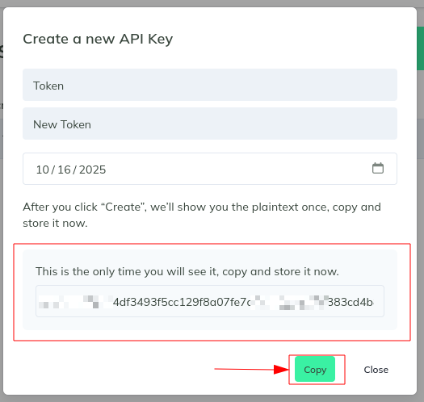
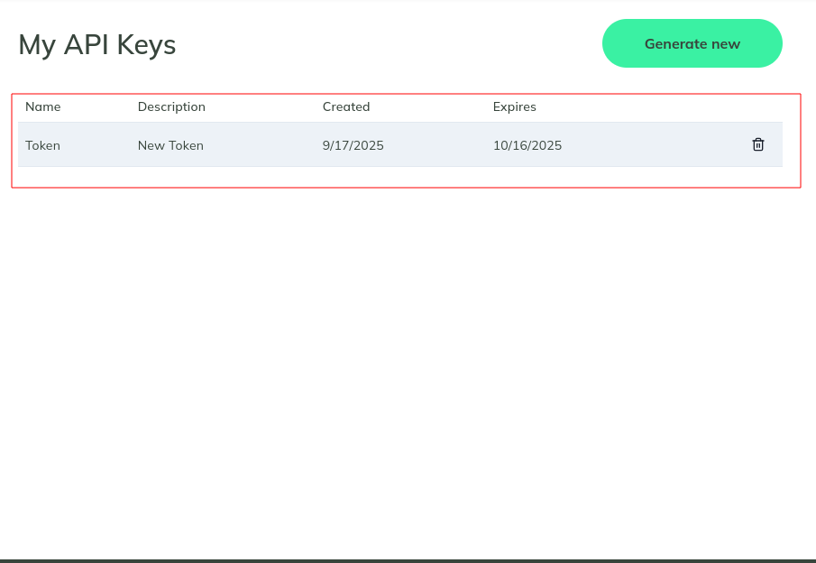
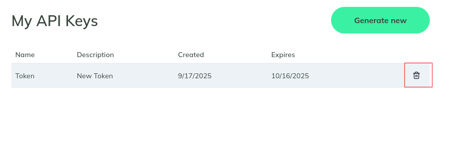
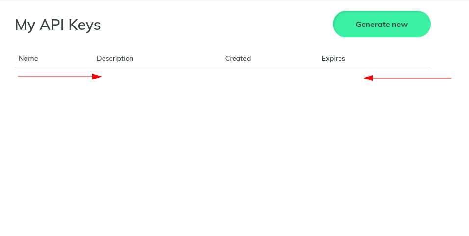

# Managing API Keys on the Global Access Platform

This guide explains how to generate, copy, and delete API keys from the Global Access Platform.

---

## 1. Open the Platform

Go to the **Global Access Platform**.
Click the **profile icon** in the top-right corner.

---

## 2. Open API Key Settings

From the dropdown menu, select **API Keys**.

---

## 3. View API Keys Page

You will see the **My API Keys** page.  
Click on **Generate new** to create a new API key.

---

## 4. Create a New API Key

Fill in the required details:

1. **Token Name**  
2. **Token Description**  
3. **Expiration Date**  
4. Click **Create**

---

## 5. Copy the API Key

After creation, the API key will be shown **only once**.  
Click **Copy** to save it securely.

---

## 6. API Key List

Your API key will now appear in the list of keys with its **name, description, created date, and expiry date**.

---

## 7. Delete an API Key

To remove an API key, click the **trash icon** next to the key.

---

## 8. Confirm Deletion

Confirm the action by clicking **Delete**.

---

## 9. API Key Removed

The list will be empty once the API key has been deleted.

---

## Notes
- API keys are shown **once** — always copy and store them securely.  
- Expired or deleted keys cannot be recovered.  
- Use API keys for secure programmatic access to the Global Access Platform.
