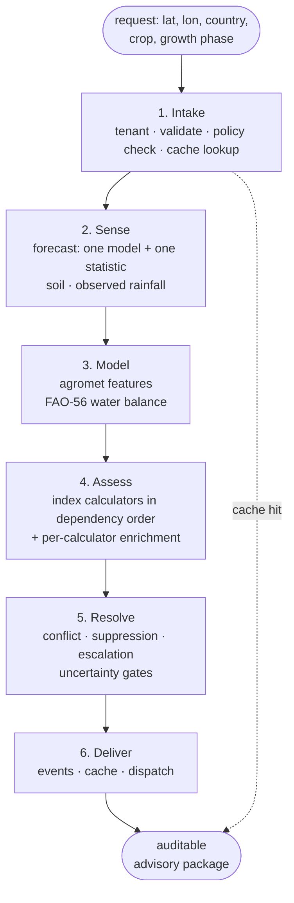

# Advisory lifecycle

A single request — for example a latitude, longitude, country, crop, and growth
phase — travels through a fixed sequence of phases and returns as an auditable
advisory package. The same phases run whether the advisory is prepared on demand
or ahead of time by a scheduled build.

Learning the phase names is the fastest way to locate where something happens:
they are the shared vocabulary for describing the pipeline.

## The phases

1. **Intake** — resolves the tenant, validates the inputs, confirms the active
   policy configuration compiled cleanly, and checks the cache. A cache hit can
   complete the request here.
2. **Sense** — retrieves the weather forecast, selecting one model and one
   statistic per country rather than blending, and gathers soil properties and
   observed rainfall. See [Weather-source selection](weather-selection.md).
3. **Model** — derives agrometeorological features and steps a soil water
   balance day by day using the FAO-56 method (the UN Food and Agriculture
   Organization standard). Where soil is not well characterised it falls back to
   a documented default **and records the substitution as a degradation**.
4. **Assess** — runs the index calculators in dependency order, then applies
   per-calculator enrichment such as soil modulation and narrative reasoning. See
   [Index and policy engines](index-and-policy-engines.md).
5. **Resolve** — the policy engine detects conflicts, applies suppression and
   escalation, and applies uncertainty gates, producing the canonical resolved
   advisory package.
6. **Deliver** — emits any events, caches the result, and optionally dispatches
   to the farmer through message orchestration. See
   [Delivery orchestration](delivery-orchestration.md).

## Properties worth internalising

- **The Model fallback is the honesty principle in miniature.** The platform does
  not quietly use a default soil profile; it uses it and records that it did, so
  the advisory carries the substitution with it.
- **Assess runs in dependency order, not arbitrary order,** because some advice
  depends on other advice.
- **Resolve exists because calculators can disagree.** Without it, whichever
  result rendered first would win.

## Where the trace comes from

Each phase contributes to the decision trace: Sense produces signals, Model
produces features, Assess produces assessments, and Resolve produces policy
decisions and recommendations. The phases and the trace node types line up
deliberately. See [Decision trace and confidence](decision-trace.md).
