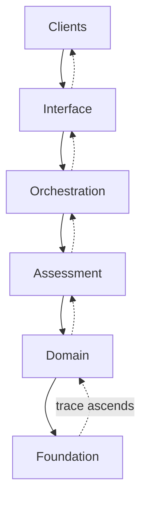

# Architecture

GAP Agentic is organised as a set of layers, each depending only on the layers
beneath it. A request descends through the layers, and results climb back
carrying a decision trace. Knowing which layer a piece of code belongs to tells
you what it may depend on and what it must not do.

## The layers

| Layer | Responsibility |
| --- | --- |
| Clients | The callers of the system: agents, applications, chatbots, and scheduled campaigns. |
| Interface | Protocol surfaces such as the MCP server and the HTTP API. |
| Orchestration | The single advisory pipeline every request converges on. |
| Assessment | Agronomic intelligence: the index calculators and policy resolution. |
| Domain | Science and state: crop calendar, crop state, soil, and weather. |
| Foundation | Data, cache, and persistence. |

The dependency graph is deliberately **acyclic** (no circular dependencies): a
cycle would make the decision trace ambiguous about what caused what.

## Two directions of travel

Requests flow top-down. The decision trace is assembled bottom-up: as results
ascend, each layer contributes trace nodes describing what it did. The strict
layering is what keeps that trace reliable.

## One pipeline, many entry points

Whether a request arrives through an MCP tool, the HTTP API, a chatbot, or a
scheduled campaign, it converges on the **same orchestration pipeline**. An
advisory must not differ by the door it came through. New surfaces therefore call
the orchestration layer rather than reimplementing advisory logic.

## No scientific logic in interfaces

A core rule follows from the layering: **the interface layer may not contain
science.** An interface component may validate input, resolve the tenant,
translate an external contract to an internal call, delegate to orchestration,
and shape the response — but it must not compute an advisory, apply agronomic
thresholds, or decide between conflicting results. Those responsibilities live in
the assessment layer and below.

This boundary is the same principle applied elsewhere in the platform, where an
interface can change scientific behaviour through defaults, selection, filtering,
aggregation, ranking, or fallback handling if the boundary is not respected. See
[Tools and handlers](../../mcp/tools-and-handlers.md) for how this rule shapes
the MCP surface.

## Related platform documentation

- [Developer architecture](../architecture.md) — the underlying data platform.
- [Advisory lifecycle](advisory-lifecycle.md) — the request path in detail.
- [Decision trace and confidence](decision-trace.md) — how auditability works.
