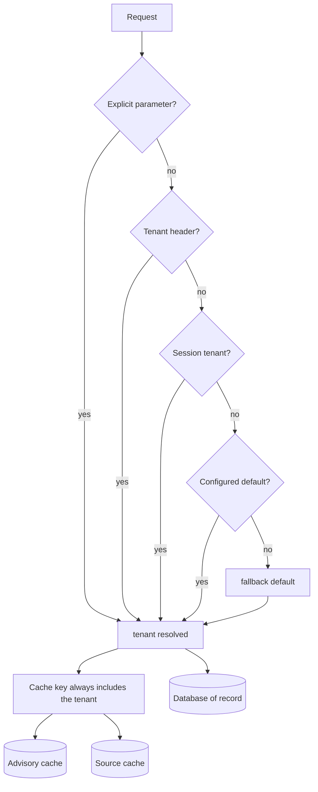

# Caching and multi-tenancy

Multi-tenancy in GAP Agentic is not just a feature; it is a **safety boundary**.
One partner seeing another partner's farmer data would be a breach, so the
architecture makes isolation structural rather than a matter of convention.

## Persistence and caching

A relational database is the authoritative store — the database of record.
Caching runs in separate namespaces, for example one for whole advisory bundles
and one for upstream source responses, backed by an in-memory store in
development and a shared cache in production.

## The tenant rule

Every cache key includes a **tenant identifier**. Tenants therefore never share a
cached response, and a cache key built without a tenant would be a cross-tenant
data leak rather than a mere performance bug. This is a hard isolation boundary
that the code is structured to make difficult to cross by accident.

## Tenant resolution

The tenant is resolved from the request in a defined order of precedence — for
example an explicit parameter, then a request header, then the session, then a
configured default, and finally a fallback default for local development. Because
a fallback exists, an unset tenant resolves rather than erroring; in a
multi-tenant deployment the tenant should always be supplied explicitly.

## What a tenant can override

A tenant is a partner with its own configuration, calibration, credentials, and
locale scope. Depending on deployment, a tenant may override values such as
weighting, per-zone thresholds, locale preferences, source credentials, and which
advisory types are enabled. This is the same configuration surface used by the
[policy engine](index-and-policy-engines.md) to let partners shape behaviour
without changing platform code.
