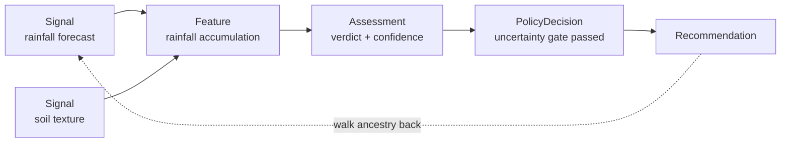

# Decision trace and confidence

Every advisory is a graph you can walk backwards, from a farmer-facing
recommendation to the raw signals beneath it. This is what makes GAP Agentic
auditable rather than a black box, and it is the technical answer to two
questions a national meteorological service will ask: "how do you know?" and
"how sure are you?"

## The trace is a DAG

Each advisory is a **directed acyclic graph (DAG)** of typed nodes. Any
recommendation can be walked back through its ancestors to the inputs that
produced it.

| Node type | Purpose |
| --- | --- |
| Signal | A raw input as received (name, value, source, timestamp). |
| Feature | A quantity derived from one or more signals. |
| Assessment | One calculator's verdict, carrying its confidence. |
| Policy decision | A rule firing during resolution. |
| Recommendation | The farmer-facing output, with its ancestry. |

## Deterministic node identity

Trace nodes are immutable, and a node's identity is derived from its own content
and its parents. An identical decision made twice therefore produces identical
node identities, so any divergence between two runs is meaningful rather than
incidental. That property makes trace comparison usable as a regression check.

## Multi-axis confidence

Rather than collapsing uncertainty into a single number, every assessment carries
a **confidence vector** across several axes, banded as HIGH / MEDIUM / LOW for
farmers. The axes capture distinct kinds of uncertainty, for example:

- **meteorology** — how trustworthy the forecast is, from model agreement and
  lead time;
- **data quality** — input completeness, lowered by missing fields and recorded
  degradations;
- **spatial representativeness** — how well a grid cell represents the specific
  farm;
- **temporal relevance** — how current the data is;
- **rule coverage** — whether the decision rules fit the case;
- **cross-signal agreement** — whether independent signals corroborate.

Confidence is **re-weighted per action.** A hazard alert leans on meteorology and
temporal relevance; a planting recommendation leans on rule coverage and
cross-signal agreement. The same vector can therefore yield different bands for
different decisions — this is intended behaviour.

Confidence is not cosmetic: the data-quality axis feeds the uncertainty gates in
the [policy engine](index-and-policy-engines.md), which can withhold advice the
platform cannot stand behind. See [Observability and degradation](observability.md)
for how a source failure propagates into confidence.
