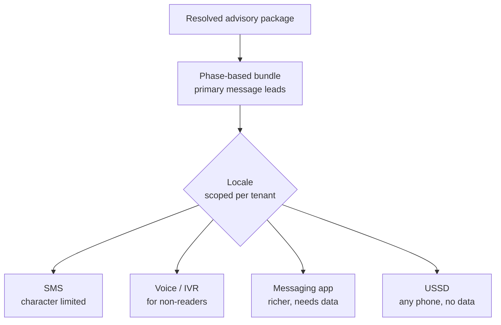

# Delivery orchestration

An advisory that is correct but undelivered is worth nothing. Delivery is where
the platform meets real constraints: patchy networks, feature phones, farmers who
may not read, and languages other than English. The key architectural idea is
that the **decision is made once** and rendering is a separate presentation
concern.

## One decision, many renderings

The canonical resolved advisory package is a structured object with primary
recommendations, supporting detail, and full ancestry. It is produced once;
channel rendering and localisation happen downstream. That is what keeps an
advisory consistent no matter how it is delivered — the same decision, differently
expressed.

## Channels and languages

Advisories are delivered across several channels with different constraints — for
example short text messages, interactive voice for non-readers, richer messaging
apps, and menu-based sessions that work on any phone without a data connection.

Localisation is **scoped per tenant** rather than applied globally, so a tenant
receives only the languages it has actually validated. This prevents a partner
from sending machine-quality text in a language no one has reviewed.

## Phase-based bundling

Each growth phase leads with a primary message and a set of supporting messages,
so an advisory highlights what matters now rather than presenting everything at
equal weight. A farmer at planting time should not have harvest advice competing
for the same limited space.

## Completion semantics

Delivery has explicit outcomes rather than fire-and-forget behaviour: a dispatch
either completes, is withheld, or is recorded as failed, and that outcome is part
of the advisory's record. Because the decision is never re-made per channel, a
delivery failure on one channel does not change the advice itself — only whether,
and how, it reached the recipient.
