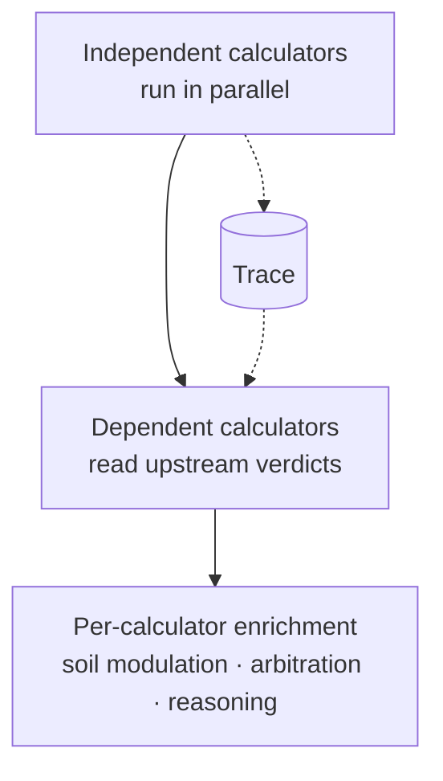
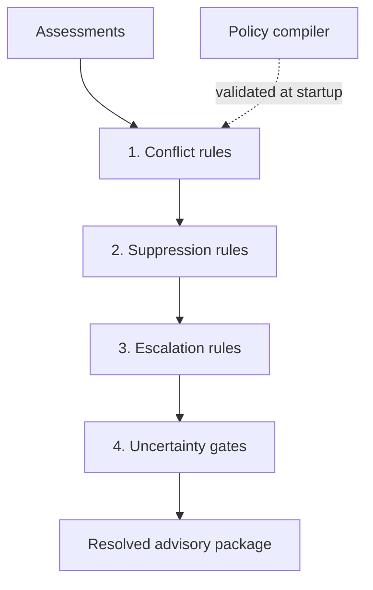

# Index and policy engines

Agronomic intelligence in GAP Agentic lives in two cooperating engines: a set of
**index calculators** that each answer one question, and a **policy engine** that
reconciles their verdicts into a single, defensible recommendation.

## The index engine

Each calculator answers one agronomic question — for example, is it a suitable
planting window, is it safe to spray, or is there a frost risk — and returns a
verdict with its confidence. Adding a new advisory type generally means adding a
new calculator, so this is the main extension point.

Some advice depends on other advice: top-dressing timing can depend on a drought
assessment; harvest timing can depend on aflatoxin risk. The engine resolves
declared dependencies into **layers** so that an upstream verdict is always
available before a downstream calculator reads it. Independent calculators run
first and in parallel; later layers read upstream results from the trace.

Every calculator declares its **go-semantics** — what a positive verdict means —
because a positive result does not mean the same thing everywhere. For planting
it means *safe to proceed*; for a hazard it means *a risk was detected*.
Declaring this lets downstream readers interpret a verdict without special-casing
each calculator by name.

After each calculator runs, a few **error-isolated** enrichments may apply, such
as adjusting thresholds for soil texture, removing redundant messages within a
single result, and building a narrative explanation. Because they are isolated, a
failed enrichment reduces detail rather than failing the advisory.



## The policy engine

Individual calculators can disagree — a planting signal may say *go* while soil
moisture says *excess*. Without a resolution step, the advice a farmer receives
would depend on arbitrary rendering order. The policy engine settles this
**deterministically, by declared rules**, in a fixed order:

1. **Conflict rules** detect incoherent combinations and mark them for
   resolution.
2. **Suppression rules** drop specific results when a condition holds (for
   example, poor data quality suppresses planting advice).
3. **Escalation rules** raise priority when hazards coincide.
4. **Uncertainty gates** withhold action advice when confidence is too low to act
   on.

Every stage can only remove or re-rank advice; none can invent new advice.



## Policy as a sovereignty lever

The decision rules are expressed as configuration — a **policy pack** — that a
country or partner supplies, rather than as platform code. A tenant can define
its own thresholds, conflict and suppression rules, escalation logic, and
approval chains, and so change behaviour without forking the platform.

Policy configuration is **validated at startup** by a compiler. Validating before
the first advisory means a malformed configuration fails the deployment rather
than a farmer's advisory. The example below shows the shape of such rules
(illustrative only):

```yaml
conflict_rules:
  - name: "excess_moisture_with_planting_go"
    condition: { soil_moisture: "excess", planting_go: true }
    action: "suppress_planting"

uncertainty_gates:
  - name: "low_forecast_confidence"
    condition: { meteorology: "< 0.3" }
    suppress: ["planting", "topdress", "spray"]
```

The second rule reads: if forecast confidence drops below the threshold, planting,
top-dressing, and spray advice are withheld entirely. The platform prefers saying
nothing to saying something it cannot stand behind.

For the legacy rules-based system this builds on, see the
[DCAS documentation](../geoparquet/dcas.md).
