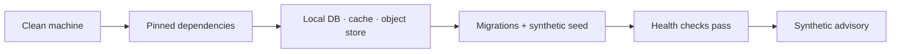

# Local development

This page describes the **shape** of a local GAP Agentic development environment
at a conceptual level. Exact commands, versions, and service endpoints belong with
the code and can change, so for the authoritative setup steps follow the project's
own installation documentation — see
[quick installation](../../quick_installation.md) — rather than any fixed command
list here.

## Target of a local environment

A local environment exists to reproduce the same contracts the platform uses in
production, connected only to non-production services, so that an engineer can
produce a synthetic advisory without touching real farmer data. It is not an
alternative deployment process; it mirrors the production contracts locally.

A working local setup generally provides:

- the application runtime and its pinned dependencies;
- a relational database, a cache, and an object-storage substitute;
- applied migrations and synthetic seed data;
- configuration supplied through a local, ignored environment file (never
  committed);
- health checks for the interface, orchestration, cache, and persistence.

## Configuration and secrets

Local configuration is supplied through an ignored environment file created from
the project's example template. Secrets are never committed and never appear in
documentation; obtain any development credentials through the project's approved
process. See [Running an advisory](running-an-advisory.md) for what a successful
local run should produce, and [Troubleshooting](troubleshooting.md) for common
issues.
