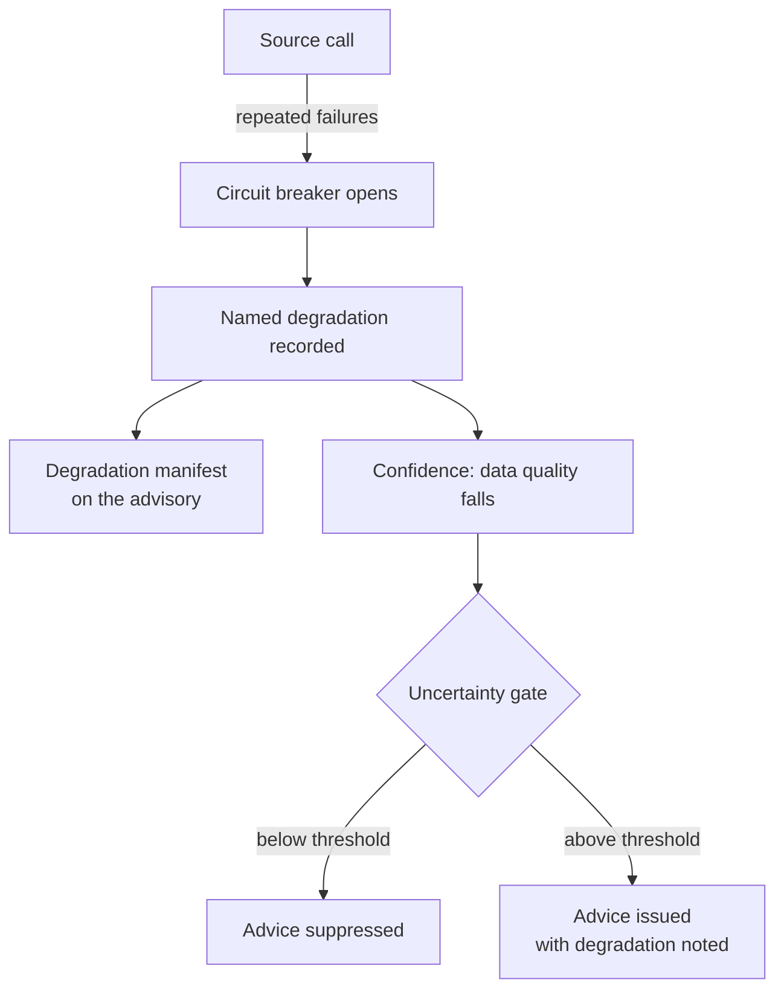

# Observability and degradation

The platform's second founding commitment is that it **degrades honestly**. When
data is missing or a source fails, the advisory records that in a structured way
rather than silently substituting a guess. For an engineer, the degradation
record is often the fastest way to understand what happened, before the logs are.

## Named degradations, not a generic flag

Every advisory can carry a manifest of what went wrong and how badly. Each entry
is a **specific named degradation** — for example, "soil defaults substituted
because the profile was missing" — rather than a generic "degraded" flag. The
specificity is the point: a named substitution is actionable, a generic flag is
not. You met one example in the [advisory lifecycle](advisory-lifecycle.md): when
soil is not well characterised, the water balance falls back to a documented
default and records the substitution.

## Circuit breakers on sources

Each external source is protected by a circuit breaker. After repeated
consecutive failures the breaker opens and further calls short-circuit, so one
unresponsive source degrades a single input rather than stalling the whole
request. An unbounded upstream call is not a slow advisory; it is a stuck job.

## The degradation loop

Degradation is connected to confidence, not merely logged. A recorded degradation
lowers the data-quality axis of the [confidence vector](decision-trace.md), which
feeds the uncertainty gates in the [policy engine](index-and-policy-engines.md).
The full loop is worth internalising:

> a source fails → its circuit breaker opens → a degradation is recorded →
> data-quality confidence falls → an uncertainty gate may suppress the advice.

The platform routes a failure all the way through to *not giving advice it cannot
stand behind*.

## Freshness, unavailable states, and metrics

Because advisories can be prepared ahead of time, freshness matters: an advisory
records when its inputs were produced, and a consumer can distinguish a current
answer from a stale one and from the case where no current answer exists yet.
Operational metrics are exposed for monitoring across domains such as request
handling, advisory production, assessment, delivery, policy, and tracing, so the
whole path — including degradation — can be observed.
