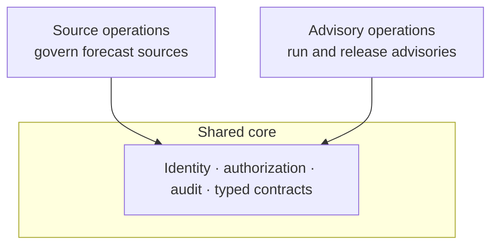

# Operator consoles

The operator product line contains two independently deployable applications over
one shared science and data plane. Naming them by responsibility avoids baking any
one institution's structure into the product.

## Two consoles, one core

- **Source operations** registers, canonicalises, validates, qualifies, and
  exchanges forecast sources. A typical operator is a national meteorological
  service.
- **Advisory operations** selects qualified sources, binds them to use cases,
  runs and reviews advisories, and delivers to farmers. A typical operator is a
  national agricultural research service.

Both live in one product-line codebase and reuse the shared shell, identity,
authorisation, audit, and typed contracts. They deliberately do **not** share
navigation, page composition, workflows, institutional vocabulary, branding, or
geography-specific screens.

A product boundary is not a repository boundary: splitting into two codebases
would let them drift apart on security fixes, migrations, session behaviour, and
audit logic.

## Roles and capabilities

Access is expressed as explicitly named **capabilities** rather than reused
generic permissions, so the same label never hides different meanings across
products. Capabilities are namespaced by domain (for example, source-related,
advisory-related, and model-related capabilities), and authorisation is scoped by
actor, capability, organisation, resource, geography, and time. Roles group
capabilities for common operators such as viewer, operator, approver, support,
and administrator.

Separation of duties — ensuring one person cannot control incompatible steps — is
a design goal of this model; see
[Specified vs implemented](specified-vs-implemented.md) for the current status of
its enforcement, and [Release and approval](release-and-approval.md) for how it
applies to farmer-facing releases.
