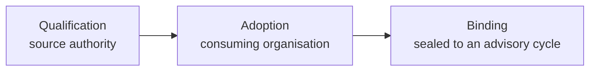

# Qualification, adoption, and binding

Technical approval of a source and the decision to use it are different
decisions, made by different organisations. Keeping them separate prevents one
organisation's authorisation from silently travelling to another country or
consumer.

## The three steps

1. **Qualification** is issued by the source authority and states that one exact
   source version meets a stated technical and governance scope.
2. **Adoption** is issued by the consuming organisation and states that it
   considers a qualified source suitable for named uses.
3. **Binding** seals the exact source version to an advisory cycle, so historical
   advice does not change when a source is later updated.

## Portable and organisation-scoped

Authorisation is **organisation-scoped**, never automatically country-scoped or
transferable. For an offline installation, a qualification can travel as a signed,
portable bundle carrying source fingerprints, supporting evidence, gate
decisions, scope, expiry, and a signature — so an agency running a
[sovereign deployment](sovereign-deployment.md) can verify governance decisions
without any network call.

Because a binding records the exact source version used, an advisory remains
reproducible: you can always determine which source produced a given cycle's
advice. This complements the [decision trace](decision-trace.md), which records
the reasoning over that source.
