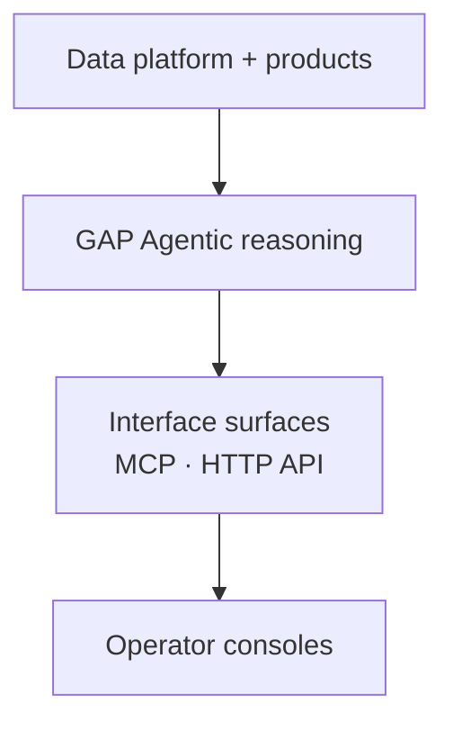

# Repositories and components

GAP is built from a small number of cooperating components over a shared data
foundation. This page orients you to those components and points to the official
pages that document each in depth.

## The core components

| Component | Responsibility | Where documented |
| --- | --- | --- |
| Data platform (GAP v1) | Curate and serve weather and climate data through APIs | [Developer architecture](../architecture.md), [API guide](../api/guide/index.md) |
| Data products | Analysis-ready products such as SPW and DCAS outputs | [SPW](../geoparquet/spw.md), [DCAS](../geoparquet/dcas.md) |
| Advisory reasoning (GAP Agentic) | Reason over the data to produce auditable advice | [GAP Agentic overview](index.md) |
| Interface surfaces | Expose capabilities to callers | [MCP overview](../../mcp/index.md) |
| Operator consoles | Govern sources and release advisories | [Operator consoles](operator-consoles.md) |

## How the pieces fit

The data platform provides curated datasets and APIs. GAP Agentic builds on that
foundation to answer per-request advisory questions, and exposes its capabilities
through interface surfaces such as the MCP server and the HTTP API. Operator
consoles sit on top for source governance and advisory release.

## GAP Agentic and GAP v1

GAP Agentic is **additive**: it reasons over the same data foundation and does not
replace the data APIs. Where a topic is about the data platform itself — datasets,
ingestion, or the public API — the official
[developer documentation](../index.md) is the authoritative source, and this
guide links to it rather than restating it.
