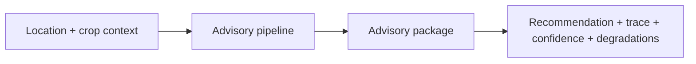

# Running an advisory

Once a [local development](local-development.md) environment is healthy, the
canonical check is to produce a **synthetic advisory**: an advisory generated from
non-production data for a chosen location and crop context. It exercises the whole
pipeline end to end without touching real farmer data.

## What a run should produce

A successful run returns an auditable advisory package. When inspecting it, look
for the signals that confirm the pipeline behaved correctly:

- a recommendation for the requested location and context;
- the decision trace linking the recommendation back to its inputs (see
  [Decision trace and confidence](decision-trace.md));
- a confidence vector, banded for readability;
- any degradations recorded on the advisory, if inputs were missing (see
  [Observability and degradation](observability.md)).

## Reading the result

Compare the output against a known-good expected result for the same synthetic
input. Because trace-node identity is deterministic (see
[Decision trace and confidence](decision-trace.md)), an identical input should
produce an identical decision, so any difference is meaningful and worth
investigating. For the phases a request passes through, see the
[advisory lifecycle](advisory-lifecycle.md).

The exact command to invoke a local advisory belongs with the code; follow the
project's own developer documentation for the current invocation.
