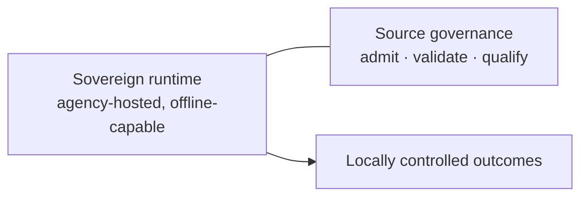

# Sovereign deployment

"Sovereign" is used for two related but distinct ideas in GAP. Keeping them
separate avoids confusion in architecture and product discussions.

## Two meanings

1. **A sovereign runtime** is a *deployment shape*: an agency-hosted, locally
   controlled, offline-capable instance that makes no required call back to
   TomorrowNow services. The agency controls its data, models, workflows, and
   the timing of its own upgrades.
2. **Source governance** is a *software capability*: the admission, validation,
   qualification, and exchange of forecast sources.

An organisation can run a sovereign runtime without operating source governance,
so "sovereign" should never be treated as shorthand for a particular console.

## Why sovereignty shapes the architecture

The goal is that a country can run its own instance, on its own infrastructure,
under its own data rules, choosing its own thresholds and upgrade timing. That
goal drives design decisions that would otherwise look unusual: offline-capable
deployments, no dependency on external content-delivery networks, and portable,
signed qualification bundles so that governance decisions can travel to an
offline installation.

The shared platform core stays interoperable through stable APIs rather than
country-specific forks, so security fixes and migrations apply everywhere without
diverging per country. See [Operator consoles](operator-consoles.md) for how
responsibilities divide across institutions, and
[Qualification, adoption, and binding](qualification-adoption-and-binding.md) for
how source governance travels between organisations.
