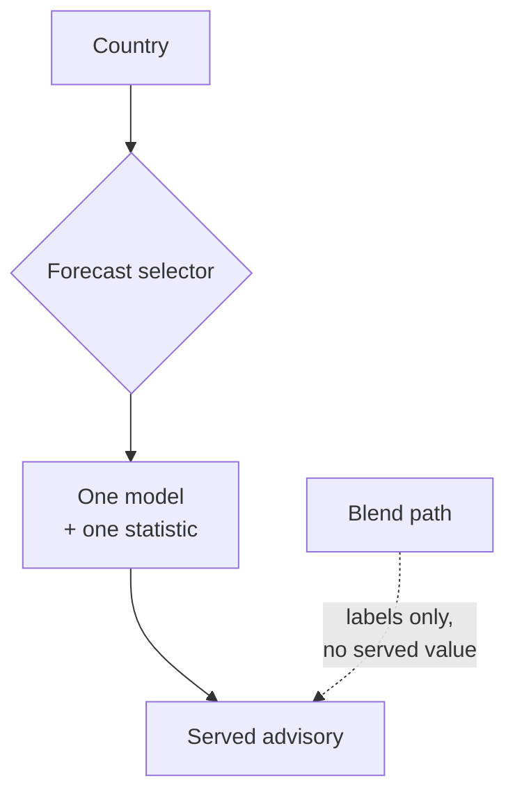

# Weather-source selection

GAP draws on many weather-source modules, but for any given country it selects
**one named model and one statistic** and serves that directly. It does not blend
models into a served value. This is one of the most consequential decisions in
the platform.

## Why not blend

Blending several models produces a number that no single model actually
predicted, which makes the resulting advisory impossible to attribute or
validate. A single named model per country can be scored against observations,
and when it is wrong the failure is legible. The guiding trade-off is that
auditability beats marginal accuracy, because an advisory that cannot be defended
cannot be deployed.

## Governed selection

The per-country choice of model and statistic is a **governed** decision rather
than a per-request accident: it is chosen deliberately and applied consistently
for that country. Different model families serve different variables — for
example, one family for precipitation and another for temperature, humidity,
wind, and solar — and they are reached through the GAP backend rather than called
directly from client surfaces.

Sources fall into two states that matter operationally:

- **Serving** — sources currently selected and used to produce advice.
- **Retired** — former sources kept for historical context but no longer served.

A source list therefore changes over time; treat the live configuration as
authoritative rather than any fixed list in documentation.

## Visible fallback on the sovereign path

Sovereignty also appears in the forecast layer: an agency can run its own model,
which becomes the primary source for that instance once it has been validated
against observations. Until then, selection falls back to an already-validated
source, and the fallback is recorded rather than hidden — consistent with the
platform's honest-degradation commitment described in
[Observability and degradation](observability.md).

For the data products underneath this selection, see the
[developer architecture](../architecture.md) and the
[SPW documentation](../geoparquet/spw.md).
