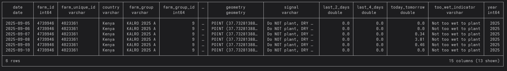
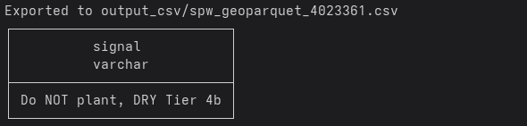

# SPW GeoParquet

The **Standard Planting Window (SPW)** dataset provides daily planting recommendations and related indicators for each farm/grid.  
Data is stored as partitioned **GeoParquet** files in the GAP bucket.

---

## Prerequisites

Python 3.9+  
[DuckDB](https://duckdb.org/) with extensions:

  - `httpfs` (S3/HTTP access)
  - `spatial` (GEOMETRY support)

Read-only GAP object storage credentials

### Environment variables

```bash
export S3_ENDPOINT_URL="https://fra1.digitaloceanspaces.com"
export S3_ACCESS_KEY_ID="YOUR_READ_ONLY_KEY"
export S3_SECRET_ACCESS_KEY="YOUR_READ_ONLY_SECRET"
export S3_BUCKET_NAME="bucket-name"
```

## Path layout

SPW is partitioned by year and month:

```bash
s3://$S3_BUCKET_NAME/staging/spw_geoparquet/year=/month=.parquet
```

An example would be:

```bash
s3://gap-products/staging/spw_geoparquet/year=2025/month=9.parquet
```

Always pass hive_partitioning=true to include partition columns.

## Column descriptions


| Column              | Type     | Description                                        |
| ------------------- | -------- | -------------------------------------------------- |
| `date`              | DATE     | Record date                                        |
| `year`              | INT      | Partition year                                     |
| `farm_id`           | BIGINT   | Internal numeric farm id                           |
| `farm_unique_id`    | VARCHAR  | External farm identifier                           |
| `country`           | VARCHAR  | Country name                                       |
| `farm_group`        | VARCHAR  | Farm group (e.g. “KALRO 2025 A”)                   |
| `farm_group_id`     | BIGINT   | Group identifier                                   |
| `grid_id`           | BIGINT   | Numeric grid identifier                            |
| `grid_unique_id`    | VARCHAR  | Unique grid identifier                             |
| `geometry`          | GEOMETRY | Farm/grid geometry                                 |
| `signal`            | VARCHAR  | Decision signal (e.g. “Do NOT plant, DRY Tier 4b”) |
| `last_2_days`       | DOUBLE   | Rainfall/indicator over last 2 days                |
| `last_4_days`       | DOUBLE   | Rainfall/indicator over last 4 days                |
| `today_tomorrow`    | DOUBLE   | Forecast indicator for today + tomorrow            |
| `too_wet_indicator` | VARCHAR  | Text category (e.g. “Not too wet to plant”)        |


## Example queries

### Filter by date

```python
from datetime import date
import os, duckdb

conn = duckdb.connect()
conn.install_extension("httpfs"); conn.load_extension("httpfs")
conn.install_extension("spatial"); conn.load_extension("spatial")

spw_date = date.fromisoformat("2025-09-10")
spw_path = (
  f"s3://{os.environ['S3_BUCKET_NAME']}/"
  f"staging/spw_geoparquet/year={spw_date.year}/month={spw_date.month}.parquet"
)

q = f"""
SELECT *
FROM read_parquet('{spw_path}', hive_partitioning=true)
WHERE date = '{spw_date}'
LIMIT 10;
"""
conn.sql(q).show()
```



### Filter by farm_unique_id

```python
farm_unique_id = '4023361'

conn.sql(f"""
CREATE OR REPLACE TABLE spw_geoparquet AS
SELECT *
FROM read_parquet('{spw_path}', hive_partitioning=true)
WHERE date BETWEEN '2025-09-05' AND '2025-09-10'
""")

conn.sql(f"""
SELECT date, farm_unique_id, farm_group, signal, too_wet_indicator
FROM spw_geoparquet
WHERE farm_unique_id = '{farm_unique_id}'
ORDER BY date DESC
""").show()
```

### Export to CSV

```python
import os
os.makedirs("output_csv", exist_ok=True)

export_q = f"""
SELECT *
FROM spw_geoparquet
WHERE farm_unique_id = '{farm_unique_id}'
"""
conn.sql(f"COPY ({export_q}) TO 'output_csv/spw_geoparquet_{farm_unique_id}.csv' (HEADER, DELIMITER ',');")
```


