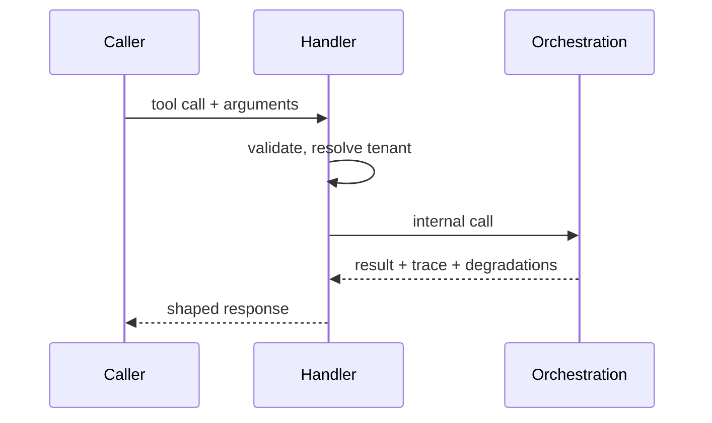

# Calling a tool

This page walks through a single Model Context Protocol (MCP) tool call at a
conceptual level. The specific tool names and fields depend on the live server;
the shape of the interaction is the same for any of them.

## The steps

1. **The caller invokes a tool by name, with arguments.** A caller — an agent, an
   application, or a scheduled campaign — selects a tool from the server's
   advertised capabilities and supplies arguments that match the tool's typed
   contract.
2. **The handler validates and resolves the tenant.** The handler checks and
   coerces the arguments, then resolves which tenant the request belongs to.
   Everything that follows is scoped to that tenant.
3. **The handler translates and delegates.** It converts the external contract
   into an internal call and hands off to the orchestration layer. The handler
   itself performs no scientific computation.
4. **Orchestration does the work.** The single advisory pipeline runs, producing
   a result together with its decision trace and any degradations. See the
   [advisory lifecycle](../developer/gap-agentic/advisory-lifecycle.md).
5. **The handler shapes the response.** It maps the internal result back onto the
   tool's declared output, surfaces any degradations, and returns it to the
   caller.

## What the caller can rely on

- **The same result regardless of entry point.** Because every surface converges
  on the same pipeline, the same request yields the same advice whether it came
  through MCP, the HTTP API, or a campaign.
- **Auditability.** The response can carry the evidence behind it; see
  [Decision trace and confidence](../developer/gap-agentic/decision-trace.md).
- **Honest degradation.** If an input was missing or a source failed, the response
  says so rather than hiding it; see
  [Observability and degradation](../developer/gap-agentic/observability.md).

To connect an MCP client to GAP in practice, see the [MCP overview](index.md).
