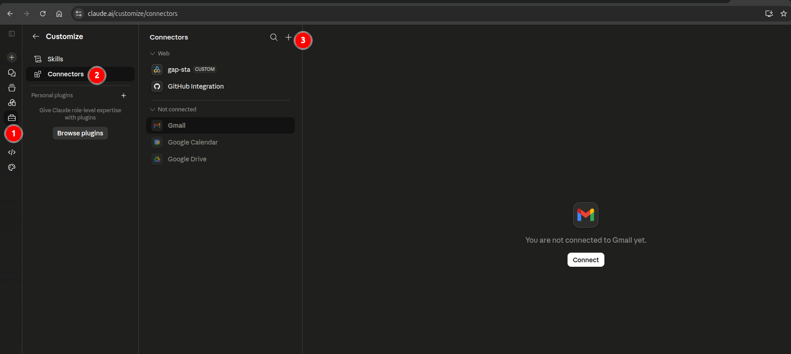
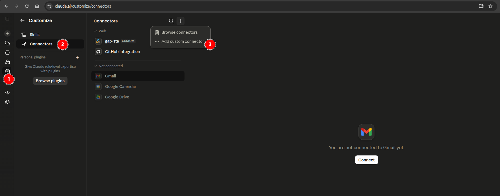
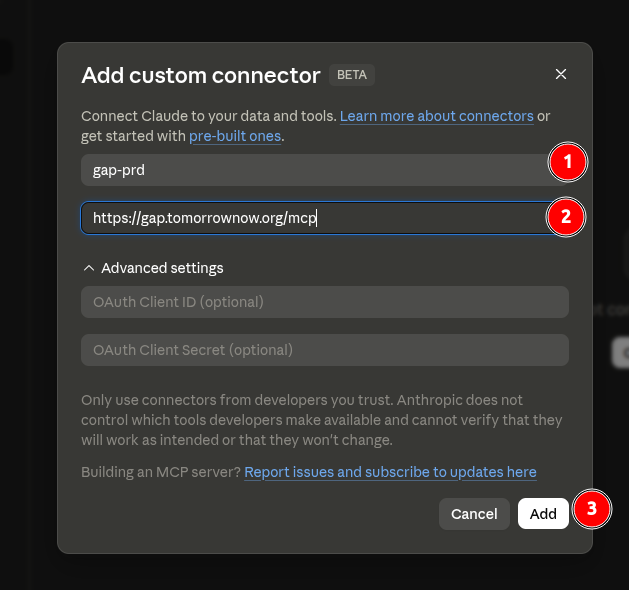
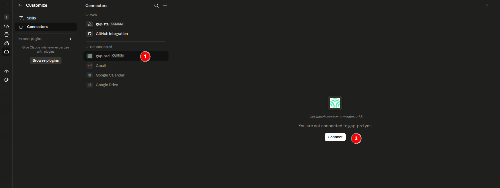
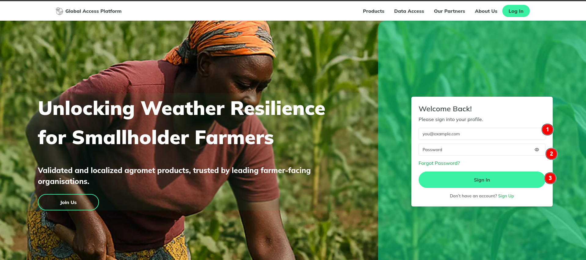
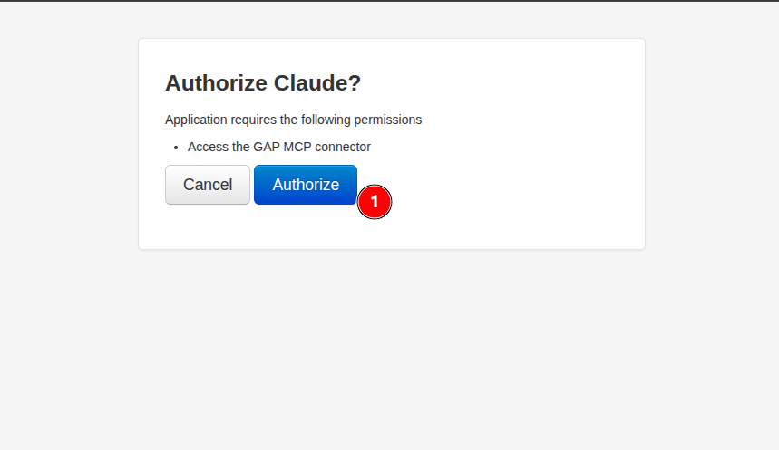
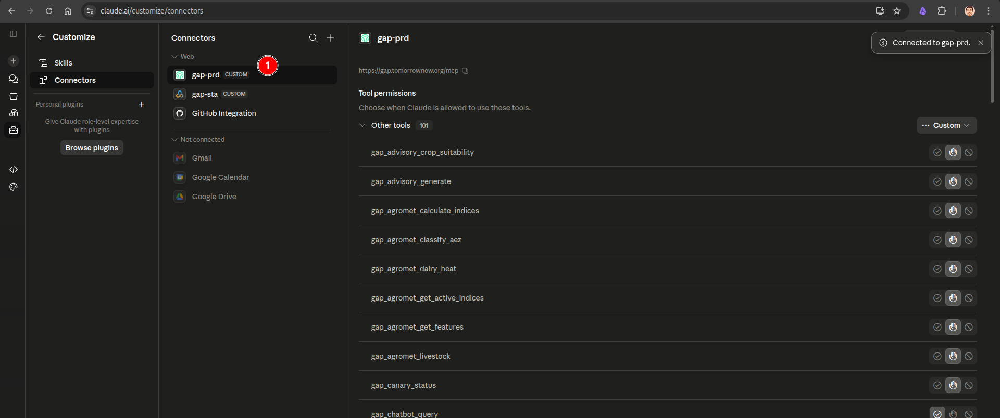

# Connecting GAP MCP to Claude.ai

The GAP platform exposes its tools (weather, advisory, spatial, agromet, and more) through an
[MCP](https://modelcontextprotocol.io) server. You can connect this server to
[Claude.ai](https://claude.ai) as a **custom connector**, which lets Claude call GAP tools directly
during a conversation.

This guide walks through adding the GAP MCP connector in the Claude.ai browser app and authorizing it
with your GAP account.

1. **Open the Connectors settings**

    In Claude.ai, click the **Settings** icon 1️⃣ in the left sidebar, then select **Connectors** 2️⃣ from the Customize menu. Click the **+** button 3️⃣ to add a new connector.

    

2. **Add a custom connector**

    From the dropdown menu, choose **Add custom connector** 3️⃣.

    

3. **Enter the GAP MCP details**

    In the **Add custom connector** dialog:

    - Give the connector a **name** 1️⃣, for example `gap-prd`.
    - Enter the GAP MCP server **URL** 2️⃣, for example `https://gap.tomorrownow.org/mcp`.
    - Leave **OAuth Client ID** and **OAuth Client Secret** under *Advanced settings* empty — the GAP MCP server handles authorization automatically in a later step.
    - Click **Add** 3️⃣.

    

4. **Connect the new connector**

    The connector now appears in the list under **Not connected** 1️⃣. Click **Connect** 2️⃣ to start authorization.

    

5. **Sign in to GAP**

    You will be redirected to the GAP Global Access Platform login page. Enter your registered **email** 1️⃣ and **password** 2️⃣, then click **Sign In** 3️⃣.

    

6. **Authorize Claude**

    GAP will ask you to confirm that Claude may access the GAP MCP connector. Click **Authorize** 1️⃣.

    

7. **Confirm the connection**

    You are returned to Claude.ai with a **Connected to gap-prd** confirmation 1️⃣. Below the connector details, the **Tool permissions** list shows every GAP tool exposed by the MCP server (over 100 tools, such as `gap_advisory_crop_suitability`, `gap_agromet_calculate_indices`, and `gap_weather_get_forecast`). For each tool you can choose whether Claude is always allowed to use it, must ask first, or is never allowed to use it.

    

    Once connected, the GAP tools become available to Claude in any conversation — start a new chat and ask a GAP-related question (for example, a weather forecast or crop advisory) to see Claude call the connector.

## Sample Prompts to Try

You don't need to know the exact tool names — speak naturally and mention the **location**, the
**crop** (if relevant), and what you want to **do** with the answer (e.g. "for a radio bulletin" or
"as an SMS"). Claude picks the right GAP tools for you. Here are some prompts to get started:

| # | Domain | Example Prompt |
|---|--------|---------------|
| 1 | Weather | "What's the weather in Kisumu this week?" |
| 2 | Land Preparation | "Is it safe to plant maize near Bomet?" |
| 3 | Crop Protection | "Can I spray tomorrow morning? I'm near Nakuru." |
| 4 | Nutrient Management | "Best day to apply urea this week in Chipata?" |
| 5 | Harvest | "When can we harvest near Homa Bay? Need 3 dry days." |
| 6 | All Domains | "Give me a complete farm advisory for Njoro, maize, vegetative stage." |
| 7 | Land Preparation | "Compare planting conditions at these 5 locations: [lat/lon list]" |
| 8 | Delivery | "Create an SMS in Swahili for farmers to wait before planting." |
| 9 | Validation | "How are our forecasts performing for Kenya this month?" |
| 10 | Validation | "Which weather model is most accurate for Zambia right now?" |
| 11 | Hazards | "Check heat stress conditions for dairy cows near Kiambu." |
| 12 | Crop Monitoring | "What agro-ecological zone is -1.2, 36.8?" |
| 13 | Weather | "Write a 200-word weather bulletin for Western Kenya radio." |
| 14 | All Domains | "Generate a DCAS synthesis for maize near Njoro with confidence scoring." |
| 15 | Data Quality | "Were there any data quality issues in this week's Kenya advisories?" |

Tips for better conversations:

- **Start simple, then drill down.** Ask a broad question first, then follow up on the details that matter.
- **Mention your location.** City names work; coordinates are even better.
- **Say what crop and stage.** "Maize in vegetative stage" gives different advice than "beans at planting."
- **Follow up freely.** Claude remembers your conversation, so you don't need to repeat location or crop details.
- **Ask "why."** If a recommendation surprises you, ask why — Claude will show the underlying data and thresholds.
