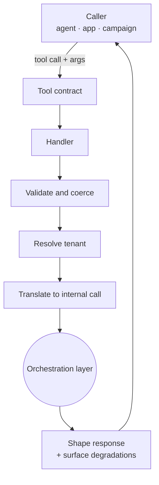

# Tools and handlers

The GAP Model Context Protocol (MCP) surface is built from two distinct things: a
**tool**, which is the contract a caller sees, and a **handler**, which is the
internal code that validates the call and delegates it inward. Keeping the two
separate is what keeps business logic out of the interface layer.

## Tool versus handler

| | Tool | Handler |
| --- | --- | --- |
| What it is | A named capability with a typed contract | The code that services a group of related tools |
| Who sees it | Callers — agents, applications, campaigns | Internal only |
| Responsibility | Declare inputs, outputs, and meaning | Validate, translate, delegate, and shape the response |

Handlers are typically grouped by domain rather than mapping one-to-one to tools,
which gives a calling agent a navigable surface and a natural place to share
validation across related tools. Exact tool and handler counts change over time,
so treat the live server's advertised capabilities as authoritative rather than
any fixed number in documentation.

## What a handler may and may not do

A handler may:

- validate and coerce input;
- resolve the tenant (see [Caching and multi-tenancy](../developer/gap-agentic/caching-and-multitenancy.md));
- translate the external contract into an internal call;
- delegate to the orchestration layer;
- shape the response and surface any degradations.

A handler must **not**:

- compute an advisory;
- apply agronomic thresholds;
- decide between conflicting results;
- reach directly into the domain or data layers.

These prohibitions all follow from one rule: **the interface layer may not
contain science.** That rule is what guarantees an advisory cannot differ by the
entry point it arrived through; see the
[GAP Agentic architecture](../developer/gap-agentic/architecture.md).

## Authentication and tenancy

Conceptually, a tool call is authenticated by the caller's GAP account, and the
handler resolves the **tenant** for the request before doing anything else. All
subsequent work — cache lookups and stored data — is scoped to that tenant, so
one tenant's request can never read another tenant's data. Credentials are never
part of the tool contract itself.
